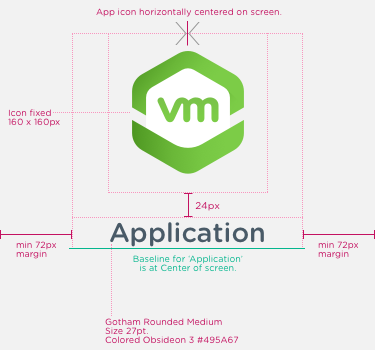

It is difficult to find a single image that displays perfectly on every mobile device. However, certain dimensions for images displayed on iOS and Android devices can work for most displays. Use these specifications for application splash screens.

## Mobile - iOS Splash Screens

* Icon, centered - 160 x 160 pixels
* Branded text distance from icon – centered at a distance of 24 pixels
* Branded text – 27 point
* Margins - 72 pixels

Tablet, Portrait - iOS Splash Screens
* Icon - 160 x 160 pixels
* Branded text distance from icon – centered at a distance of 24 pixels
* Branded text – 27 point
* Margins - 264 pixels

Tablet, Landscape - iOS Splash Screens
* Icon - 160 x 160 pixels
* Branded text distance from icon – centered at a distance of 24 pixels
* Branded text – 27 point
* Margins - 292 pixels

Mobile - Android Splash Screens
* Icon - 160 x 160 pixels
* Branded text distance from icon – centered at a distance of 24 pixels
* Branded text – 27 point
* Margins - 56 pixels

Tablet, Portrait - Android Splash Screens
* Icon - 160 x 160 pixels
* Branded text distance from icon – centered at a distance of 24 pixels
* Branded text – 27 point
* Margins - 260 pixels

Tablet, Landscape - Android Splash Screens
* Icon - 160 x 160 pixels
* Branded text distance from icon – centered at a distance of 24 pixels
* Branded text – 27 point
* Margins - 388 pixels
