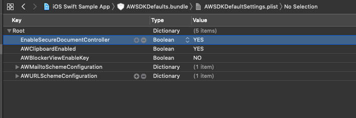

You can manage document-sharing in your Workspace ONE SDK for iOS (Objective-C)-built app using the SDK and configuring the SDK default settings in the Workspace ONE UEM console.

## Workspace ONE UEM Console Configurations

Have the Workspace ONE UEM admin configure the default SDK profile to share documents with specified apps and assign the profile to your SDK-built app in the console. Here is an outline of what settings the admin sets.
1. In the Workspace ONE UEM console, navigate to Groups & Settings > All Settings > Settings and Policies > Security Policies > Data Loss Prevention.
2. Select Enabled.
3. Select Yes for Limit Documents to Open Only in Approved Apps.
4. In the Allowed Applications List text box, enter the apps you want to restrict sharing to. Think of these apps as trusted apps.

## Developer Additions

Along with console configuraitons, app developers must set additional Boolean key-value pairs in the AWSDKDefaultSettings.plist of the SDK-built app.

## EnableSecureDocumentController

* Set this Boolean value in the AWSDKDefaultSettings.plist.
* Use this value to restrict document-sharing with the Apple class UIDocumentInteractionController.
* Boolean Value Explanations
  * Set the value to YES - Files opened with UIDocumentInteractionController are restricted to open in apps trusted by the Workspace ONE UEM console. Also, documents that are shared by flipping to another app (opened in another app) are restricted to open in apps trusted by the Workspace ONE UEM console. In the SDK-built app, iOS titles this interaction as Copy to > <Application Name> in the Open menu.
  * Set the value to NO - The SDK does not restrict the opening of shared documents with UIDocumentInteractionController to the trusted apps set in the default SDK profile.
* App Extensions Are Restricted
  * App extensions cannot open shared documents when you use EnableSecureDocumentController and UIDocumentInteractionController. Users see a placeholder document rather than the shared document.
  * If your SDK-built must use app extensions, do not configure the Workspace ONE UEM console or do not use EnableSecureDocumentController. You can also set EnableSecureDocumentController to NO and use app extensions.

## DisableActivityViewController

* Set this Boolean value in the AWSDKDefaultSettings.plist.
* Use this value to prevent the use of UIActivityViewController for SDK-built apps that do not use UIDocumentInteractionController.
* Boolean Value Explanations
  * Set the value to YES - The SDK prevents all item-sharing using UIActivityViewController.
  * Set the value to NO - The SDK does not prevent all item-sharing using UIActivityViewController.

## Do Not Set Both Values to YES

Set one of the values (DisableActivityViewController or EnableSecureDocumentController) to YES. Do not set them both to YES. Setting both values to YES can cause undefined behavior in your SDK-built app.