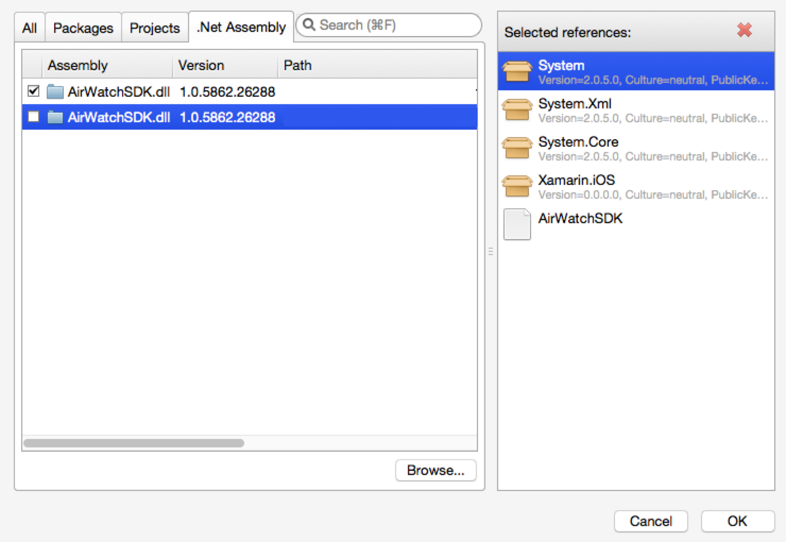
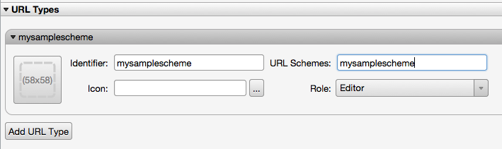
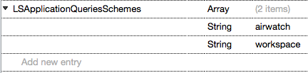

## Overview

The steps in this tutorial are NOT required if you are using App Wrapping or approaches from AppConfig.org. This tutorial will illustrate how to setup the SDK framework for those who have chosen the SDK approach.

Before moving forward to the SDK setup tutorial, ensure you have completed the instructions in the [General Setup tutorial](../Getting%20Started/index.md) and uploaded your app with an assigned SDK profile.

!!!Important
    You will need to download the SDK binary separately via [https://components.xamarin.com/view/awsdk](https://components.xamarin.com/view/awsdk).

## Requirements

- iOS 7+
- Visual Studio or Xamarin Studio
- iOS Test Device
- AirWatch SDK Binding from the Xamarin Component Store

## Tutorial

### Add Required SDK DLL to Xamarin Project

In order to use the SDK, first add it to your Project.

1. Open the Solution
1. Right-click References and choose Edit References…
1. Click the .Net Assembly Tab and then click the Browse… button
1. Select the AirWatchSDK.dll file from your file system
1. Ensure that the Assembly is Checked and click Ok


### Add Callback Scheme Registration

In order to receive a call back from the AirWatch Agent, your application will need to expose a custom scheme in the info.plist.

1. Double-click the Info.plist file in your project
1. Click on the “Advanced” tab
1. In the URL Types section, click the Add URL Type button
1. Set the values of identifier and URL Schemes to the desired callback scheme.
1. Set the Role to Editor
1. Save the file.


### Add SDK Application Query Scheme

1. Double-click the Info.plist file in your project
1. Click on the “Source” tab
1. Click Add new entry at the bottom
1. Click the green “PLUS” in the selected row
1. Double click Custom Property and change it to LSApplicationQueriesSchemes
1. Change the Type from String to Array
1. Within the Array click Add new entry at the bottom
1. Click the green “PLUS” in the selected row
1. Double-click the Value column
1. Set the value to airwatch
1. In a similar manner, add another entry under LSApplicationQueriesSchemes for AWSSOBroker2.
1. Save the file.


### Add the SDK Integration to Your Project

Create a class to act as an `AWSDKDelegate` and receive SDK callbacks. In the example above the class `AirWatchSDKManager` is used. This class can be implemented as follows:

```C
using Foundation;
using System.Diagnostics;
using System;
using AirWatchSDK;

namespace sdksampleapp_2016
{
    public class AirWatchSDKManager: AWSDKDelegate
    {
       private static AirWatchSDKManager instance;
       private static string LogCategory = "AirWatchSDK";

       // private, use the Instance below
       private AirWatchSDKManager ()
       {
       }

       // singleton
       public static AirWatchSDKManager Instance {
         get {
          if (instance == null) {
              instance = new AirWatchSDKManager ();
          }
          return instance;
         }
       }

       // Below are all the protocol methods defined in AWSDKDelegate
       // Add customization here for SDK results

       override public void InitialCheckDoneWithError (NSError error)
       {
         // Add any SDK Customization here
         string message = String.Format ("InitialCheckDoneWithError received {0}, SDK initialized if no error", error);
         Debug.WriteLine (message, LogCategory);
       }

       override public void ReceivedProfiles (AWProfile[] profiles)
       {
         // Add any SDK Customization here
         string message = String.Format ("ReceivedProfiles received {0}", profiles);
         Debug.WriteLine (message, LogCategory);
       }

       override public void Wipe ()
       {
         // Add any SDK Customization here
         Debug.WriteLine ("Wipe command received", LogCategory);
       }

       override public void Lock ()
       {
         // Add any SDK Customization here
         Debug.WriteLine ("Lock command received", LogCategory);
       }

       override public void Unlock ()
       {
         // Add any SDK Customization here
         Debug.WriteLine ("Unlock command received", LogCategory);
       }

       override public void StopNetworkActivity ()
       {
         // Add any SDK Customization here
         Debug.WriteLine ("StopNetworkActivity received", LogCategory);
       }

       override public void ResumeNetworkActivity ()
       {
         // Add any SDK Customization here
         Debug.WriteLine ("ResumeNetworkActivity received", LogCategory);
         }
       }
    }
```

2. Inside the AppDelegate.cs add the following:

```C
using System;
using ObjCRuntime;
using System.Diagnostics;
using AirWatchSDK;
```

…

```C
public override bool FinishedLaunching (UIApplication application, NSDictionary launchOptions)
{
    if (Runtime.Arch == Arch.SIMULATOR) {
       Debug.WriteLine ("Running in Simulator, skipping initialization of the AirWatch SDK!");
       return true;
    } else {
       Debug.WriteLine ("Running on Device, beginning initialization of the AirWatch SDK.");

       // Configure the Controller by:
       var sdkController = AWController.ClientInstance ();
       // 1) defining the callback scheme so the app can get called back,
       sdkController.CallbackScheme = "mysamplescheme"; // defined in Info.plist
       // 2) set the delegate to know when the initialization has been completed.
       sdkController.Delegate = AirWatchSDKManager.Instance;
       return true;
    }
}

public override void OnActivated (UIApplication application)
{
    AWController.ClientInstance ().Start ();
}

public override bool HandleOpenURL (UIApplication application, NSUrl url)
{
    return AWController.ClientInstance ().HandleOpenURL (url, application);
}
```

### Debug Your Application

Your application is now integrated with the SDK! Once you call the start method, you should expect to receive the initialCheckDoneWithError callback without any errors.

!!!Note
    In order for the SDK to initialize successfully, your app bundle ID will need to match the bundle ID of the application you uploaded in General Setup tutorial section.

### Next Steps

Once the SDK setup is completed, move on to the next SDK sections to implement the feature specific logic.
