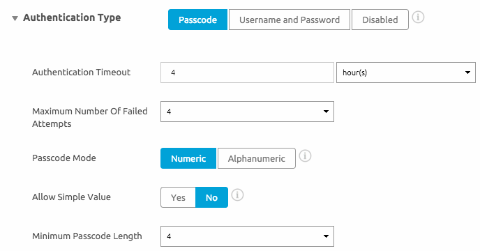
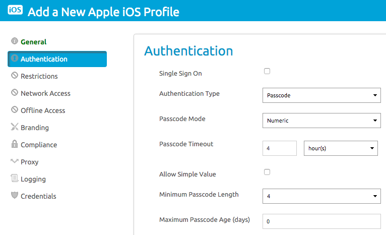

## Overview

The steps in this tutorial are done with the assumption that you have gone through the steps in [General Setup tutorial](../index.md) as well as the SDK Setup section.

Important: You will need to download the SDK binary separately via [https://components.xamarin.com/view/awsdk](https://components.xamarin.com/view/awsdk).

## Requirements

- iOS 7+
- Visual Studio or Xamarin Studio
- iOS Test Device
- AirWatch SDK Binding from the Xamarin Component Store

## Tutorial

At this point in the tutorial, we assume you have already implemented the `AWController` initialization methods as well as the `AWSDKDelegate` callbacks. If you haven’t done so, refer back to SDK Setup.

### Passcode Policy Configuration

Log into the AirWatch Console and identify if the SDK profile you assigned to your SDK application is the default profile or a custom profile. If there is no profile assigned, you can choose from one of two ways to configure the policy: group-wide default settings or an ad-hoc custom profile.

### Using the Default Profile (Recommended)

1. If the profile assigned is the default profile, then the policy settings can be edited by navigating to Apps & Books > All Apps & Books Settings > Apps > Settings And Policies > Security Policies.
1. Set Authentication Type to Passcode and configure an appropriate timeout, max number of failed attempts, and passcode complexity.

2. Once you are done, click save to enforcing the new policy.

### Using an Ad-hoc Custom Profile

1. If the profile assigned is a custom profile you’ve created, then the policy settings can be edited by navigating to Apps & Books > All Apps & Books Settings > Apps > Settings And Policies > Profiles and then selecting the SDK profile you’ve assigned to your app.
2. Edit the profile, and select the authentication payload on the left and configure an appropriate timeout, max number of failed attempts, and passcode complexity.

3. Once you are done, click save to start enforcing the new policy.

### Implementation

1. The SDK automatically handles the presentation / dismissal of the passcode view controllers as long as you call start on the `AWController` clientInstance and have configured a passcode policy mentioned in the earlier steps.
2.  There are 3 `AWSDKDelegate` callbacks relevant to the passcode you will need to listen to: lock, unlock, and wipe.
 
```C
       override public void Wipe ()
       {
         // Add any SDK Customization here
         Debug.WriteLine ("Wipe command received", LogCategory);
       }

       override public void Lock ()
       {
         // Add any SDK Customization here
         Debug.WriteLine ("Lock command received", LogCategory);
       }

       override public void Unlock ()
       {
         // Add any SDK Customization here
         Debug.WriteLine ("Unlock command received", LogCategory);
       }
```

3. Your application should implement these methods to pause any processing while locked or delete any databases or other resources used by your app in case of a wipe. Note that the AirWatch SDK will only wipe the data present and used by the SDK when it receives a “wipe” instruction. The application developer must implement the necessary local app wipe logic.

#### Debug Your Application

Your application is now protected with a passcode! After configuring the profile and calling start on the SDK, a passcode workflow will be presented. If you find that you are not seeing an SSO passcode, ensure that the Organization Group where your device is enrolled has passcode enabled with the Authentication Type.
